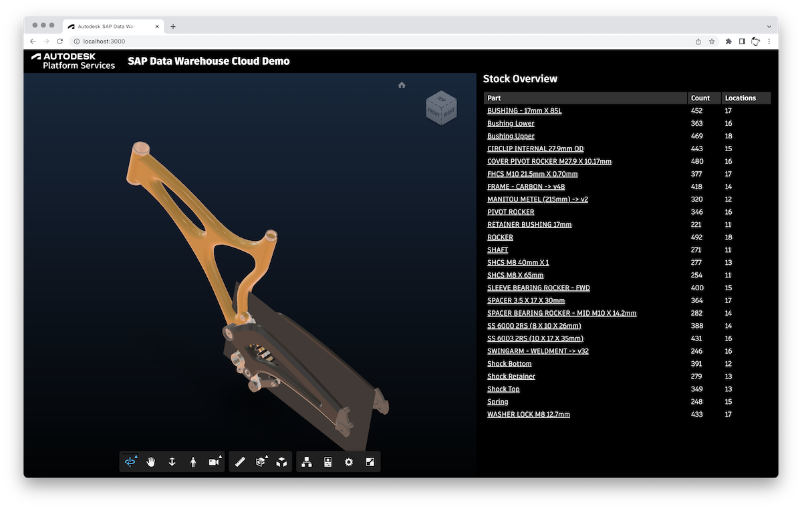

# forge-sap-poc

Prototype application integrating Autodesk Forge and SAP Data Warehouse Cloud.

## Can I run it locally?

Currently the setup of the application is a bit tricky as it involves things like:

- Obtaining Forge application credentials
- Preparing a 3D design with specific metadata
- Creating several tables and views in the SAP Data Warehouse Cloud
- Populating the tables/views with sample data corresponding to the 3D design

Because of that, the sample app is currently _not_ intended to be runnable by others.
